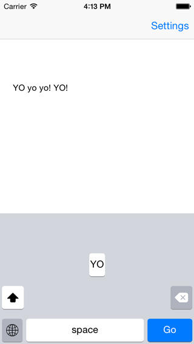
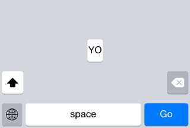
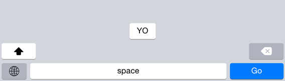
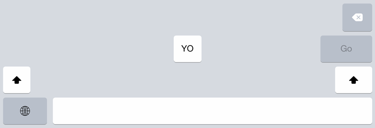

# ACKeyboard

ACKeyboard is a keyboard extension for iOS that mimics the system keyboard, except it has only one 'letter' key: "yo". 

## Description

The project contains two targets:

- the keyboard extension
- an application to test the keyboard with different settings

The keyboard has the following features:

- iPhone and iPad layout
- portrait and landscape support
- light and dark appearances
- capitalization
- repeat delete
- end of line punctuation
- auto-enable return key

The keys have the following features:

- drawn with core graphics
- light, dark, blue (for enter key) styles
- regular and lock (shift) keys
- different per-device color sets

## Screenshots

iPhone portrait:

iPhone landscape:

iPad portrait:

## Demo

Run the demo application in the iOS simulator to try it out.

To enable the keyboard, open the Settings app and go to:

General > Keyboard > Keyboards > Add New Keyboard... > ACKeyboard

## Extending and making your own keyboard

### Keys

To make a key with a title:

    ACKey *key = [ACKey keyWithStyle:KeyStyleLight
                          appearance:KeyAppearanceLight
                               title:@"A"];
                               
or to make a key with a picture:

	ACKey *key = [ACKey keyWithStyle:KeyStyleLight
                          appearance:KeyAppearanceLight
                               image:[UIImage imageNamed:@"global_portrait"]];

being a UIControl subclass, a target-action can be associated to the key for an event:
    
      [key addTarget:self
              action:@selector(keyTapped:)
    forControlEvents:UIControlEventTouchUpInside];
  
and the key can be added as a subview:
 
    key.frame = phoneKeyboardMetrics.frame;
    [self.view addSubview:key];

The ACLockKey is a special key that can be locked, like the "shift" key. An image for the lock state can be specified:

	lockKey.lockImage = [[UIImage imageNamed:@"shift_lock_portrait"] imageWithRenderingMode:UIImageRenderingModeAlwaysTemplate];
	
and it can be locked with, for instance a double tap:

	...
	    [lockKey addTarget:self action:@selector(shiftButtonTapped:)
	      forControlEvents:UIControlEventTouchDown];
	    [lockKey addTarget:self action:@selector(shiftButtonDoubleTapped:)
	      forControlEvents:UIControlEventTouchDownRepeat];
    ...

	- (void)shiftButtonDoubleTapped:(ACLockKey*)lockKey {
	    lockKey.locked = ! lockKey.isLocked;
	}

### Metrics

iPhone and iPad keys layout are defined in PhoneKeyboardMetrics.h and PadKeyboardMetrics.h. All the calculation is done manually, without autolayout, to prevent some occasional jerkiness.

The dimensions are calculated by doing linear interpolation:

	    CGFloat letterKeyWidth = LINEAR_EQ(keyboardWidth,
                                       kPhoneKeyboardPortraitWidth, 26.0,
                                       kPhoneKeyboardLandscapeWidth, 52.0);
                                       
where, here, 26.0 and 52.0 are measured key width for portrait and landscape.

### Appearance

The keyboard implements a light and dark appearance (ACLightAppearance and ACDarkAppearance).

The color sets can vary with the device type. The device can be checked with the UIDevice+Hardware category:

	if ([[[UIDevice currentDevice] machine] hasPrefix:@"iPhone4,1"]) {
        blueKeyColor = [UIColor colorWithRed:9/255.0
                                       green:126/255.0
                                        blue:254/255.0
                                       alpha:1.0];
        
    }

## Documentation

If you have [appledoc](http://gentlebytes.com/appledoc/) installed, you can generate the documentation by running the corresponding target.
